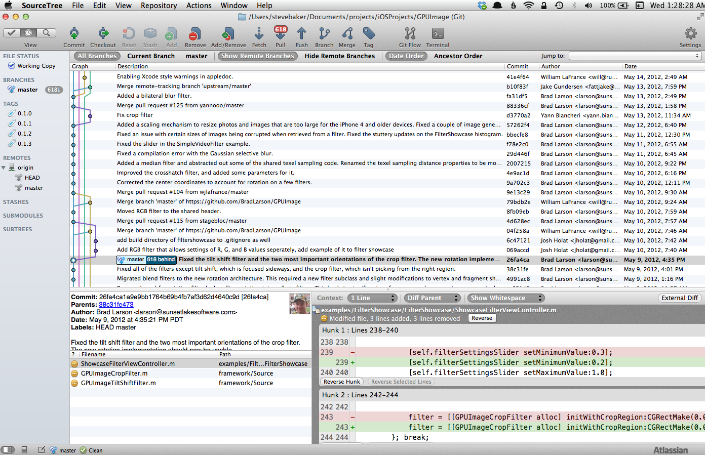
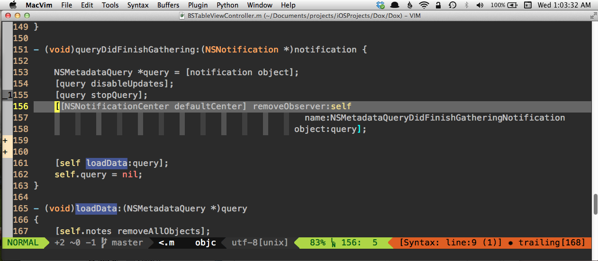
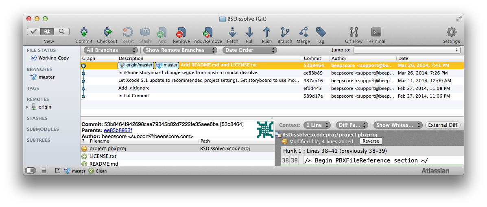
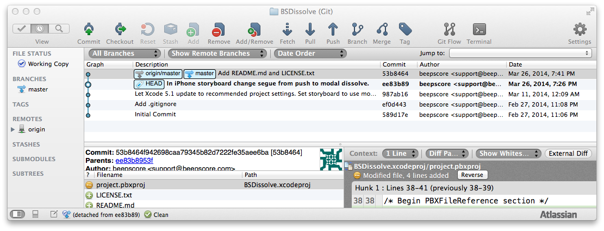
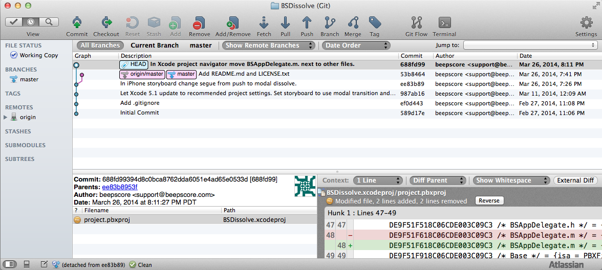
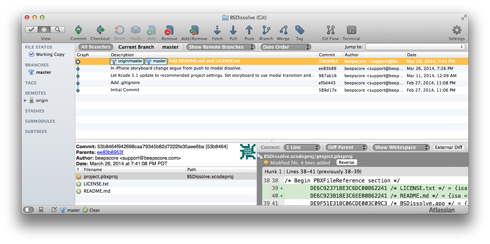
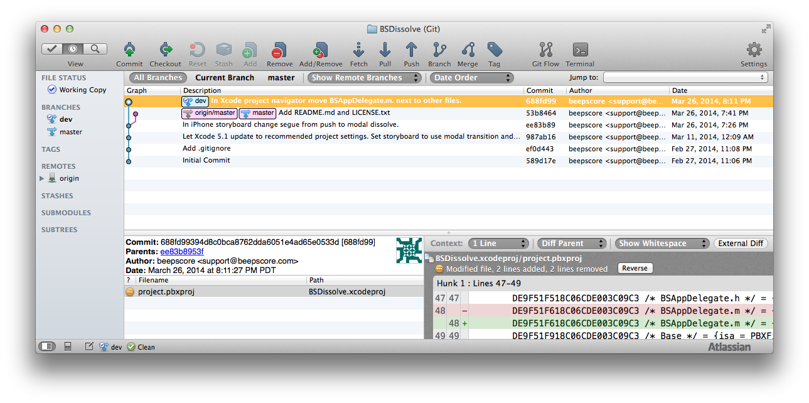
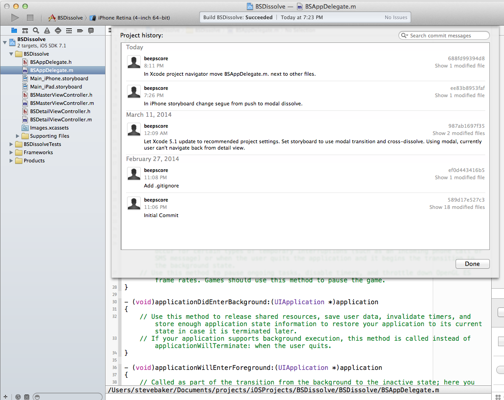
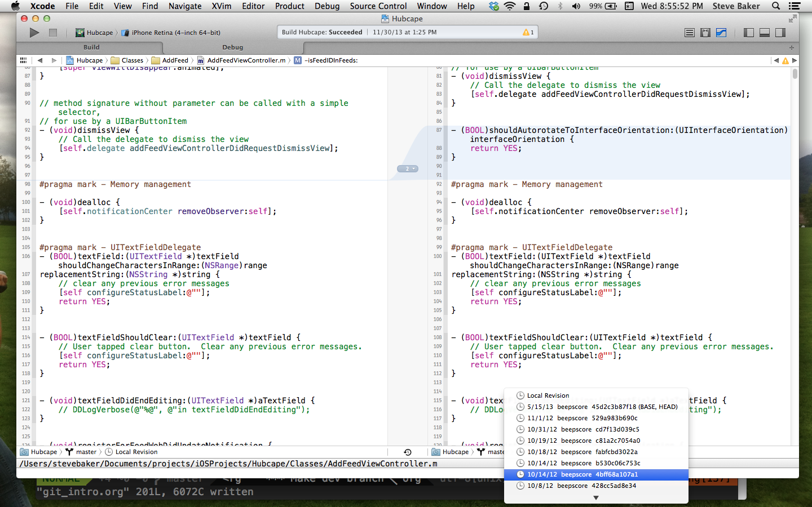
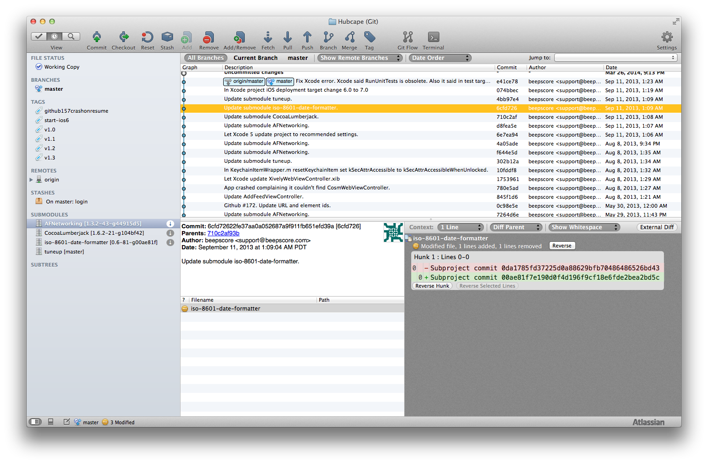

<!DOCTYPE html>
<html>
<head>
    <title>git version control in and out of Xcode</title>
    <link rel="stylesheet" href="style.css">
</head>
<body>

# git version control in and out of Xcode

# Summary
Steve Baker will talk about "git version control, in and out of Xcode" or "How to safely detach your head!"  
Designed for beginning/intermediate git users.  
Topics: Commit, branch, tag using SourceTree gui, Xcode, command line.  
Stash, selective commit or discard changes.  
Diffing changes using Xcode, SourceTree, FileMerge, MacVim.  
Checking out previous versions, branch, detached head state, command line reflog.  
.gitignore  
Using github as a remote: push, pull.  
Potential intermediate topics include reverting commits, working with other developers on multiple branches, resolving merge conflicts.  

# Topics

## Creating a git repository

    $ git init

   <a href="images/star_wars_clone.jpg">What's this?</a>

## Cloning an existing git repository from github

In bash, cd to directory that will contain the new project folder, e.g. 
  cd MyProjects

  git clone git@github.com:beepscore/BeepscoreProject.git

## How git tracks changes

### SHA
Everything in Git is check-summed before it is stored and is then referred to by a SHA-1 hash.
This means it's impossible to change the contents of any file or directory without Git knowing about it.

### directed acyclic graph
Nodes connected by arrows. No closed loops.

### Working directory -> Staging area -> Repository
### branch is last commit, advances automatically
### Unlike SVN, branch doesn't clutter file structure in Finder.

### tag doesn't move

## Stage
## Commit
## Selective Commit
## SHA
## .gitignore
## Stash
## Discard hunk
## Git diff
### Xcode
 

### SourceTree
 

### MacVim
 

## Branches

List all branches

    $ git branch

Create a new branch named mybranch, referencing the same point in history as the current branch

    $ git branch mybranch
    $ git checkout mybranch

Remove some-branch from the remote repo (e.g. github)

    $ git push origin :heads/some-branch

## Detached head

 

    BSDissolve git:(master) git checkout ee83b8953faf44545b61488d6ab13a6df81fc19a
    Note: checking out 'ee83b8953faf44545b61488d6ab13a6df81fc19a'.

    You are in 'detached HEAD' state. You can look around, make experimental
    changes and commit them, and you can discard any commits you make in this
    state without impacting any branches by performing another checkout.

    If you want to create a new branch to retain commits you create, you may
    do so (now or later) by using -b with the checkout command again. Example:

  git checkout -b new_branch_name

HEAD is now at ee83b89... In iPhone storyboard change segue from push to modal dissolve.
$  BSDissolve git:(ee83b89)

 

   <a href="images/clone_detached_head.jpg">What's this?</a>

   Commit 688fd99
 

## reflog
Shows commits not on any branch path.

   $ git checkout master

    53b8464 HEAD@{0}: checkout: moving from 688fd99394d8c0bca8762dda6051e4ad65e0533d to master

    688fd99 HEAD@{1}: commit: In Xcode project navigator move BSAppDelegate.m. next to other files.

    ee83b89 HEAD@{2}: checkout: moving from master to ee83b8953faf44545b61488d6ab13a6df81fc19a
    53b8464 HEAD@{3}: checkout: moving from ee83b8953faf44545b61488d6ab13a6df81fc19a to master
    ee83b89 HEAD@{4}: checkout: moving from master to ee83b8953faf44545b61488d6ab13a6df81fc19a
    53b8464 HEAD@{5}: commit: Add README.md and LICENSE.txt
    ee83b89 HEAD@{6}: commit: In iPhone storyboard change segue from push to modal dissolve.
    987ab16 HEAD@{7}: commit: Let Xcode 5.1 update to recommended project settings. Set storyboard to use modal transition and cross-dissolve. Using modal, currently user can't navigate back from detail view.
    ef0d443 HEAD@{8}: commit: Add .gitignore
    589d17e HEAD@{9}: commit (initial): Initial Commit

### Don't see 688fd99

 

    BSDissolve git:(master) git checkout 688fd99

### Make dev branch
    BSDissolve git:(688fd99) git branch dev
    BSDissolve git:(688fd99) git checkout dev

 

Xcode Source Control History

 

Xcode Version Editor

 

## Submodule

 

### Make local changes, stage, commit, push

    $ touch README
    $ git add README
    $ git commit -m 'first commit'
    $ git push origin master

alternatively, run SourceTree

### Getting changes from others
Get the latest changes from the remote, doesn't do a local commit.

    $ git fetch origin

pull is same as fetch followed by commit.

    $ git pull

## Undoing changes

### If modified but not staged:

    $ git checkout (mybranch) (filename)

Or in Xcode right click on file, "discard changes".
Or in SourceTree, open repository directory, at top right select Discard.

### If modified and staged but not commited

    $ git reset HEAD (filename)

### Undoing committed changes (Git Immersion Lab 16)
Create a commit that undoes previous commit.

    $ git revert HEAD

Create a commit that undoes back to commit (sha).

    $ git revert (sha)

# References
Pro Git Book
<http://git-scm.com/book/en/>

How To Use Git Source Control with Xcode in iOS 6
<http://www.raywenderlich.com/13771/how-to-use-git-source-control-with-xcode-in-ios-6>

SourceTree GUI
<http://www.sourcetreeapp.com/>

Git Immersion
<http://gitimmersion.com/>

Git User's Manual
<http://www.kernel.org/pub/software/scm/git/docs/user-manual.html>

.gitignore files including Objective-C.gitignore
<https://github.com/github/gitignore>

</body>
