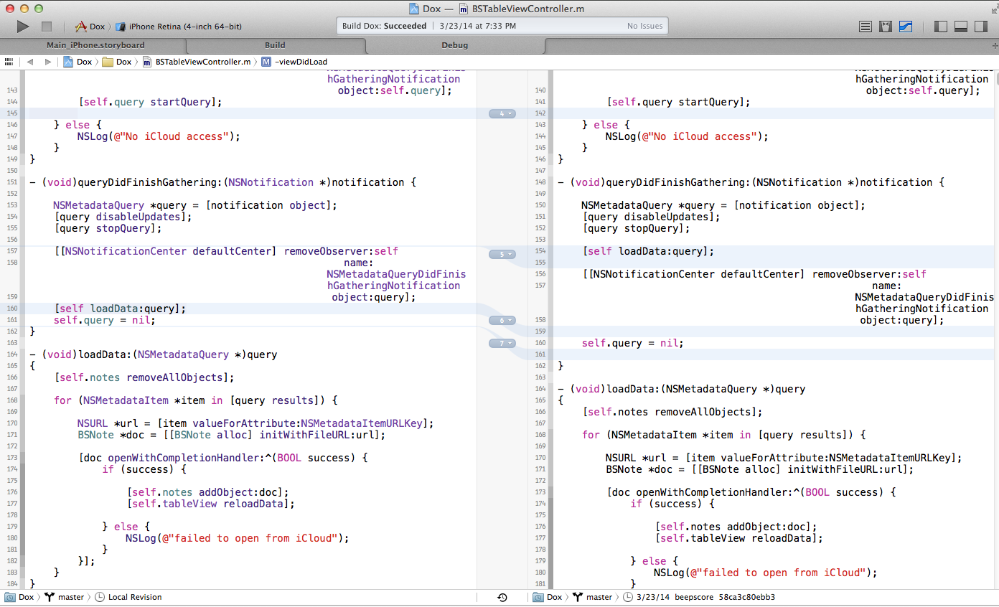

<!DOCTYPE html>
<html>
<head>
    <title>git version control in and out of Xcode</title>
    <link rel="stylesheet" href="style.css">
</head>
<body>

# git version control in and out of Xcode

# Summary
Steve Baker will talk about "git version control, in and out of Xcode" or "How to safely detach your head!"  
Designed for beginning/intermediate git users.  
Topics: Commit, branch, tag using SourceTree gui, Xcode, command line.  
Stash, selective commit or discard changes.  
Diffing changes using Xcode, SourceTree, FileMerge, MacVim.  
Checking out previous versions, branch, detached head state, command line reflog.  
.gitignore  
Using github as a remote: push, pull.  
Potential intermediate topics include reverting commits, working with other developers on multiple branches, resolving merge conflicts.  

# Topics

## How git tracks changes

### SHA
Everything in Git is check-summed before it is stored and is then referred to by a SHA-1 hash.
This means it’s impossible to change the contents of any file or directory without Git knowing about it.

### directed acyclic graph
Nodes connected by arrows. No closed loops.

### Working directory -> Staging area -> Repository
### branch is last commit, advances automatically
### Unlike SVN, branch doesn't clutter file structure in Finder.

### tag doesn't move

## Stage
## Commit
## SHA
## .gitignore
## Stash
## Discard hunk
## Git diff
### Xcode
 

### SourceTree
### MacVim

## Branches

## Detached head
## reflog
Shows commits not on any branch path.

## Submodule

## Cloning an existing git repository from github

In bash, cd to directory that will contain the new project folder, e.g. 
  cd MyProjects

  git clone git@github.com:beepscore/BeepscoreProject.git

## Creating a git repository in the project
in Finder, create new folder MyProject 
or in bash

    $ mkdir MyProject

in bash

    $ cd MyProject

in Finder, copy file Objective-C.gitignore into directory MyProject

in bash, rename Objective-C.gitignore to .gitignore (can't do this from Finder)  

    $ mv Objective-C.gitignore .gitignore

list files, including hidden files that start with "."  

    $ ls -a

create a git repository

    $ git init

### Make local changes, stage, commit, push

    $ touch README
    $ git add README
    $ git commit -m 'first commit'
    $ git push origin master

alternatively, run SourceTree

### Getting changes from others
Get the latest changes from the remote, doesn't do a local commit.

    $ git fetch origin

pull is same as fetch followed by commit.

    $ git pull

## Undoing changes

### If modified but not staged:

    $ git checkout (mybranch) (filename)

Or in Xcode right click on file, "discard changes".
Or in SourceTree, open repository directory, at top right select Discard.

### If modified and staged but not commited

    $ git reset HEAD (filename)

### Undoing committed changes (Git Immersion Lab 16)
Create a commit that undoes previous commit.

    $ git revert HEAD

Create a commit that undoes back to commit (sha).

    $ git revert (sha)

## Log a file's revision history (Git Immersion Lab 23)

    $ git log -- myfile
    $ git log -p myfile

## Manipulating branches(Git Immersion Lab 24)

List all branches

    $ git branch

Create a new branch named mybranch, referencing the same point in history as the current branch

    $ git branch mybranch
    $ git checkout mybranch

Merge mybranch into the current branch. Doesn't delete mybranch

    $ git merge mybranch

Delete the branch mybranch; if the branch you are deleting points to a commit which is not reachable from the current branch, this command will fail with a warning. When run in local repository, deletes branch in local repository only.

    $ git branch -d mybranch

Remove some-branch from the remote repo (e.g. github)

    $ git push origin :heads/some-branch

# References
Pro Git Book
<http://git-scm.com/book/en/>

How To Use Git Source Control with Xcode in iOS 6
<http://www.raywenderlich.com/13771/how-to-use-git-source-control-with-xcode-in-ios-6>

SourceTree GUI
<http://www.sourcetreeapp.com/>

Git Immersion
<http://gitimmersion.com/>

Git User's Manual
<http://www.kernel.org/pub/software/scm/git/docs/user-manual.html>

.gitignore files including Objective-C.gitignore
<https://github.com/github/gitignore>

</body>
